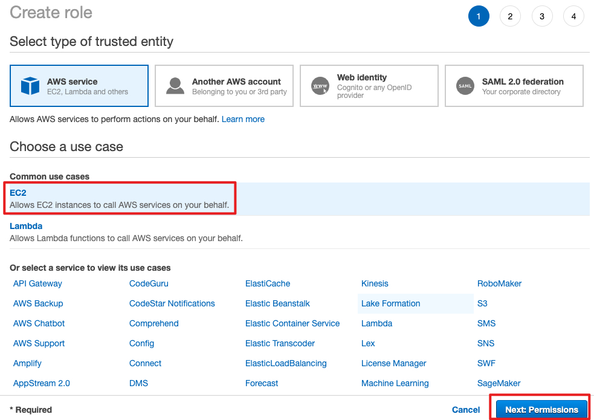
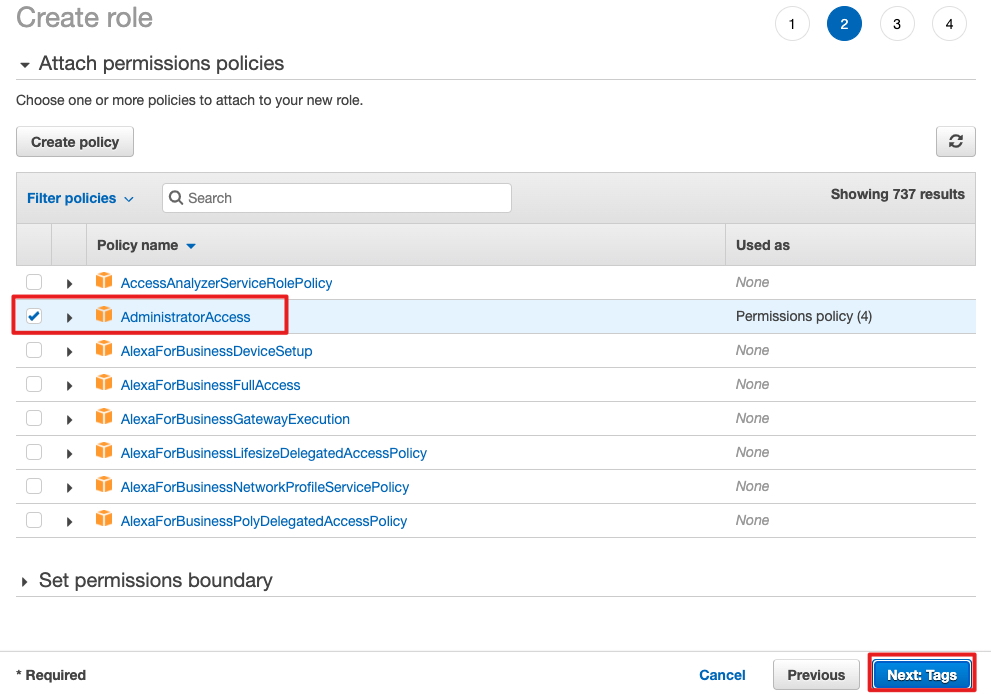
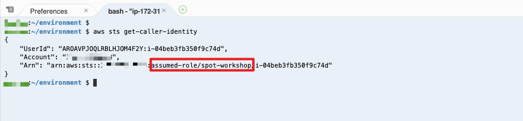

# 前言：

- [ ] 在开始创建k8s/EKS之前，需要准备环境。
- [ ] 比较快捷的方式是创建Cloud9的环境，因为IDE做好好用，大部分的EKS所需库都已经内置。
- [ ] Cloud9的配置也需要按要求做好，因为权限和EKS紧密相连。
- [ ] 通常一个EKS是由一个（开发）团队来运维，这个时候可以将配置成功的Cloud9共享给团队一同使用。
- [ ] Cloud9创建在《Management VPC》中的公有子网。


<u>下面开始：</u>


## Web IDE based on Cloud9 简介

这是一个基于Cloud9 Core构建的Web IDE ，用户只需要一个浏览器，即可编写、运行和调试代码。这个Web IDE包括了一个代码编辑器、调试程序和终端。同时预封装了适用于 Python 等常见编程语言的基本工具，用户无需安装文件或配置开发环境，即可开始新的项目。Web IDE 基于云，因此可以从办公室、家中或任何地方使用已连接互联网的计算机完成项目。

### 亮点

- 基于开源的Cloud9 Core构建，用户可免费使用。
- 高度集成，无需额外安装文件或配置，即可基于web IDE进行开发。
- 体验接近Amazon Cloud9服务，作为Amazon Cloud9服务在中国区的替代品。

### 描述

这是一个基于Cloud9 Core构建的Web IDE ，用户只需要一个浏览器，即可编写、运行和调试代码。这个Web IDE包括了一个代码编辑器、调试程序和终端。同时预封装了适用于 Python等常见编程语言的基本工具，用户无需安装文件或配置开发环境，即可开始新的项目。Web IDE 基于云，因此可以从办公室、家中或任何地方使用已连接互联网的计算机完成项目。

Amazon Web Services在海外区域上线了Cluod9服务，除了上述基本的Web开发功能，Cloud9 还可以为开发无服务器应用程序提供无缝体验，使用户能够轻松定义资源、进行调试，并在本地和远程执行无服务器应用程序之间来回切换。借助 Cloud9，用户可以与团队快速共享开发环境，从而能够将程序配对，并实时跟踪彼此的输入。

目前Amazon Web Services北京和宁夏区域暂时未上线Cloud9服务，因此这个AMI利用了开源的Cloud9 Core来构建一个Web IDE，可以在北京和宁夏区域快速启动一个基于Cloud9的Web IDE。


## 创建 Cloud9 环境

使用 AWS 用户登录: https://cn-northwest-1.console.amazonaws.cn/console/home?region=cn-northwest-1

**请确认，并将 AWS Region 切换成您的 Workshop 使用的区域 - 宁夏区域。**

创建 Cloud9 环境, 步骤如下面截图所示:


[步骤-1]

从《亚马逊云科技 marketplace》上启动Cloud9环境 https://awsmarketplace.amazonaws.cn/marketplace/pp/prodview-jybbc6npmjr72z ，点击订阅，并按照提示完成


选择最新的版本，区域为宁夏


[步骤-2] 使用Cloud9的AMI创建EC2（一键链接为 https://cn-northwest-1.console.amazonaws.cn/ec2/home?region=cn-northwest-1#LaunchInstances:ami=ami-00974946d12b0f21a;product=bd382a3c-a1bc-470f-a0b9-8273cb3b907c）

配置参考如下：


[步骤-3] 网络设置，确保在 Management VPC 的公有子网里，创建C9。


点击启动实例。等待创建完成。


[步骤-4]  查看实例启动状态。 此时实例已经正常启动，点击红色框中的实例ID可以查看实例的相关信息


[步骤-5] 留意在这个窗口下可以查看到实例的ID和实例的公有IP/DNS，后续登陆Cloud9时需要用到


[步骤-6] 登陆Cloud9。在浏览器中输入 [http://实例公有IP:8181](http://xn--ip-pt3c84e26ufvq:8181/) ，并在弹出的窗口中输入

- 用户名： aws
- 密码： 实例ID（即上一个步骤中获取到的实例ID）

[](https://github.com/linjungz/cloud9/blob/master/pics/launch-12.jpg) 

验证成功后即可登陆至Cloud9 Web IDE[](https://github.com/linjungz/cloud9/blob/master/pics/launch-13.jpg) 


# 安装所需工具和软件包


## 安装 JQ 和 envsubst

```
sudo yum -y install jq gettext
```

## 验证 jq, envsubst

```
for command in jq envsubst
  do
    which $command &>/dev/null && echo "$command in path" || echo "$command NOT FOUND"
  done
```

## 安装 AWS CLI

验证当前版本

```
aws --version
```

更新到最新版本

```
curl "https://awscli.amazonaws.com/awscli-exe-linux-x86_64.zip" -o "awscliv2.zip"
unzip awscliv2.zip
sudo ./aws/install
. ~/.bash_profile

```

确认最新版本安装成功

```
aws --version
```


# 创建 IAM Role


1.  在 AWS Console 选择 IAM 服务

2. 选择 AWS service --> EC2, 点击 "Next: Permissions"



3. 选择 "AdministratorAccess" 权限策略



4. 依次选择 “Next: Tags” 和 "Next: Review"

5. 命名角色名称, 比如 "fargate-workshop", 然后点击 "Create role"


# 添加 IAM Role 至 Cloud9 实例


1. 在 EC2 界面上找到您的 Cloud9 实例

2. 选择 Cloud9 对应的 EC2 实例, 然后选择: Actions --> Instance Settings --> Attach/Replace IAM Role


3. 选择上面创建的角色如 "fargate-workshop", 点击 Apply


# 更新 Cloud9 环境


删除当前已经保留的 credentials 文件:

```
rm -vf ${HOME}/.aws/credentials
```

配置 AWS CLI 的当前的 region 信息:

```
export ACCOUNT_ID=$(aws sts get-caller-identity --output text --query Account)
export AWS_REGION=$(curl -s 169.254.169.254/latest/dynamic/instance-identity/document | jq -r '.region')

echo "export ACCOUNT_ID=${ACCOUNT_ID}" >> ~/.bash_profile
echo "export AWS_REGION=${AWS_REGION}" >> ~/.bash_profile

aws configure set default.region ${AWS_REGION}
aws configure get default.region
```

验证 Cloud9 已经使用最新的角色关联:

```
aws sts get-caller-identity
```




### 本章节完成
